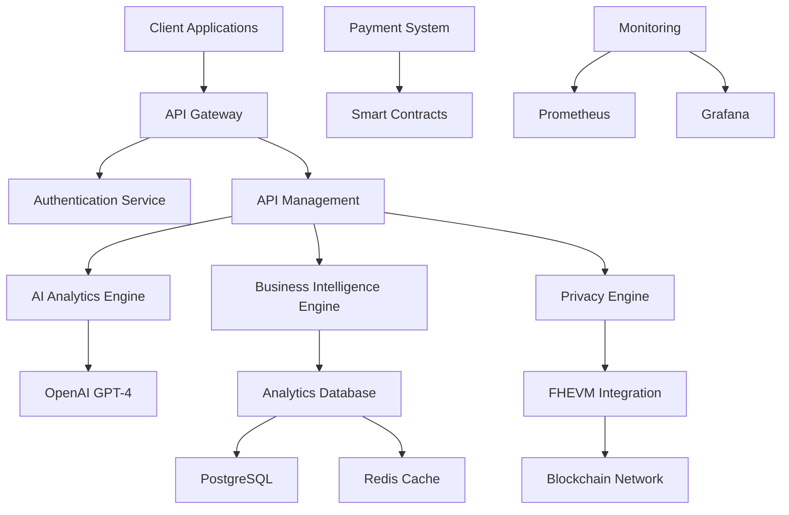

#      AI Analytics API Marketplace - Technical Specification

##      Technical Overview

This document provides detailed technical specifications for the **TrustVault AI Analytics API Marketplace** platform,
including API designs, system architecture, security requirements, and implementation guidelines.

---

##         System Architecture

###      High-Level Architecture



###      Core Components

#### **1. API Gateway**

- **Technology**: Kong or AWS API Gateway
- **Functions**: Request routing, rate limiting, authentication
- **Features**: Load balancing, SSL termination, request/response transformation

#### **2. Authentication Service**

- **Technology**: JWT + OAuth 2.0
- **Functions**: User authentication, authorization, session management
- **Features**: Multi-factor authentication, role-based access control

#### **3. AI Analytics Engine**

- **Technology**: Node.js + Python
- **Functions**: AI model integration, data processing, result generation
- **Features**: OpenAI GPT-4 integration, custom model support

#### **4. Privacy Engine**

- **Technology**: Zama FHEVM
- **Functions**: Encrypted data processing, privacy preservation
- **Features**: Homomorphic encryption, zero-knowledge proofs

#### **5. Blockchain Integration**

- **Technology**: Ethereum + Solidity
- **Functions**: Smart contracts, payment processing, data storage
- **Features**: FHEVM integration, oracle connectivity

---

##      API Specifications

### 1. **AI Analytics API**

#### **Endpoint**: `POST /api/v1/analytics/analyze`

#### **Request Format**

```json
{
  "data": {
    "type": "encrypted",
    "content": "FHEVM encrypted data",
    "format": "json|csv|text"
  },
  "analysisType": "sentiment|trend|prediction|custom",
  "parameters": {
    "model": "gpt-4|gpt-3.5|custom",
    "language": "en|th|auto",
    "confidence": 0.8,
    "maxTokens": 1000
  },
  "privacyLevel": "high|medium|low",
  "metadata": {
    "source": "user_input|api|upload",
    "timestamp": "2024-12-01T00:00:00Z",
    "userId": "user_123"
  }
}
```

#### **Response Format**

```json
{
  "success": true,
  "data": {
    "insights": "AI-generated insights and analysis",
    "confidence": 0.95,
    "recommendations": ["Actionable recommendation 1", "Actionable recommendation 2"],
    "metadata": {
      "processingTime": "2.5s",
      "model": "gpt-4",
      "tokensUsed": 850,
      "cost": 0.25
    }
  },
  "privacy": {
    "level": "high",
    "encrypted": true,
    "auditTrail": "audit_123"
  }
}
```

#### **Error Handling**

```json
{
  "success": false,
  "error": {
    "code": "INVALID_DATA",
    "message": "Invalid data format provided",
    "details": "Data must be properly encrypted using FHEVM",
    "timestamp": "2024-12-01T00:00:00Z"
  }
}
```

### 2. **Business Intelligence API**

#### **Endpoint**: `POST /api/v1/business/analyze`

#### **Request Format**

```json
{
  "dataType": "sales|customer|financial|operational",
  "encryptedData": "FHEVM encrypted business data",
  "analysisScope": "department|company|industry",
  "timeframe": "real-time|daily|weekly|monthly|yearly",
  "parameters": {
    "metrics": ["revenue", "growth", "efficiency"],
    "comparison": "previous_period|industry_benchmark",
    "forecast": true,
    "confidence": 0.9
  },
  "compliance": {
    "regulations": ["GDPR", "HIPAA", "SOX"],
    "retention": "90d|1y|7y"
  }
}
```

#### **Response Format**

```json
{
  "success": true,
  "data": {
    "insights": "Business intelligence insights",
    "trends": {
      "direction": "upward|downward|stable",
      "magnitude": 0.15,
      "confidence": 0.88
    },
    "recommendations": [
      {
        "action": "Increase marketing budget",
        "priority": "high",
        "impact": "15% revenue increase",
        "timeline": "30 days"
      }
    ],
    "kpis": {
      "revenue": 1250000,
      "growth": 0.15,
      "efficiency": 0.85
    },
    "forecast": {
      "nextMonth": 1400000,
      "nextQuarter": 4500000,
      "confidence": 0.82
    }
  }
}
```

### 3. **Privacy-Preserving Analytics API**

#### **Endpoint**: `POST /api/v1/privacy/analyze`

#### **Request Format**

```json
{
  "encryptedData": "FHEVM encrypted data",
  "analysisType": "aggregate|comparative|predictive",
  "privacyLevel": "maximum|high|standard",
  "compliance": {
    "regulations": ["GDPR", "HIPAA", "SOX"],
    "dataRetention": "30d|90d|1y",
    "auditRequired": true
  },
  "parameters": {
    "aggregation": "sum|average|count|median",
    "groupBy": ["department", "region", "time"],
    "filters": {
      "dateRange": "2024-01-01 to 2024-12-31",
      "categories": ["A", "B", "C"]
    }
  }
}
```

#### **Response Format**

```json
{
  "success": true,
  "data": {
    "encryptedResults": "FHEVM encrypted analysis results",
    "privacyReport": {
      "level": "maximum",
      "dataExposed": "none",
      "aggregationOnly": true,
      "compliance": "GDPR_compliant"
    },
    "insights": "Privacy-preserving insights",
    "auditTrail": {
      "id": "audit_456",
      "timestamp": "2024-12-01T00:00:00Z",
      "actions": ["encrypt", "process", "aggregate"],
      "compliance": "verified"
    }
  }
}
```

### 4. **On-Chain Analytics API**

#### **Endpoint**: `GET /api/v1/onchain/analytics`

#### **Request Format**

```json
{
  "query": {
    "type": "transaction|contract|defi|nft",
    "network": "ethereum|polygon|arbitrum",
    "timeframe": "1h|24h|7d|30d",
    "filters": {
      "address": "0x...",
      "contract": "0x...",
      "token": "ETH|USDC|USDT"
    }
  },
  "parameters": {
    "metrics": ["volume", "count", "fees", "gas"],
    "aggregation": "sum|average|count",
    "groupBy": ["hour", "day", "week"]
  }
}
```

#### **Response Format**

```json
{
  "success": true,
  "data": {
    "analytics": {
      "volume": 1250000,
      "transactions": 15420,
      "fees": 12500,
      "gasUsed": 45000000
    },
    "trends": {
      "volumeChange": 0.15,
      "transactionChange": 0.08,
      "direction": "upward"
    },
    "insights": "On-chain analytics insights",
    "metadata": {
      "network": "ethereum",
      "timeframe": "24h",
      "lastUpdated": "2024-12-01T00:00:00Z"
    }
  }
}
```

### 5. **Oracle Integration API**

#### **Endpoint**: `POST /api/v1/oracle/submit`

#### **Request Format**

```json
{
  "data": {
    "type": "external|internal|computed",
    "source": "api|database|calculation",
    "content": "Data to be submitted to blockchain"
  },
  "oracle": {
    "type": "chainlink|custom",
    "network": "ethereum|polygon|arbitrum",
    "contract": "0x...",
    "function": "updateData"
  },
  "parameters": {
    "gasLimit": 200000,
    "gasPrice": "20 gwei",
    "priority": "high|medium|low"
  }
}
```

#### **Response Format**

```json
{
  "success": true,
  "data": {
    "transactionHash": "0x...",
    "blockNumber": 12345678,
    "gasUsed": 150000,
    "status": "confirmed|pending|failed",
    "oracleResponse": {
      "requestId": "req_123",
      "data": "Submitted data",
      "timestamp": "2024-12-01T00:00:00Z"
    }
  }
}
```

---

##      Security Specifications

###         Authentication & Authorization

#### **JWT Token Structure**

```json
{
  "header": {
    "alg": "RS256",
    "typ": "JWT"
  },
  "payload": {
    "sub": "user_123",
    "iss": "trustvault-ai",
    "aud": "api",
    "exp": 1735689600,
    "iat": 1735603200,
    "roles": ["user", "analyst"],
    "permissions": ["read", "write", "admin"]
  }
}
```

#### **API Key Management**

```typescript
interface APIKey {
  id: string;
  userId: string;
  key: string;
  permissions: string[];
  rateLimits: {
    requests: number;
    period: string;
  };
  expiresAt: Date;
  createdAt: Date;
  lastUsed: Date;
}
```

###      Data Encryption

#### **FHEVM Integration**

```typescript
interface FHEVMConfig {
  network: "ethereum" | "polygon" | "arbitrum";
  contractAddress: string;
  privateKey: string;
  encryptionKey: string;
  privacyLevel: "maximum" | "high" | "standard";
}
```

#### **Data Encryption Flow**

1. **Client Side**: Data encrypted using FHEVM
2. **API Gateway**: Validates encryption and authentication
3. **Processing**: Encrypted data processed without decryption
4. **Response**: Results encrypted before transmission
5. **Client Side**: Results decrypted using user's key

###         Security Headers

```http
X-Content-Type-Options: nosniff
X-Frame-Options: DENY
X-XSS-Protection: 1; mode=block
Strict-Transport-Security: max-age=31536000; includeSubDomains
Content-Security-Policy: default-src 'self'
```

---

##      Database Schema

###    „    Core Tables

#### **Users Table**

```sql
CREATE TABLE users (
    id UUID PRIMARY KEY,
    email VARCHAR(255) UNIQUE NOT NULL,
    password_hash VARCHAR(255) NOT NULL,
    role VARCHAR(50) NOT NULL,
    created_at TIMESTAMP DEFAULT NOW(),
    updated_at TIMESTAMP DEFAULT NOW(),
    last_login TIMESTAMP,
    is_active BOOLEAN DEFAULT TRUE
);
```

#### **API Keys Table**

```sql
CREATE TABLE api_keys (
    id UUID PRIMARY KEY,
    user_id UUID REFERENCES users(id),
    key_hash VARCHAR(255) NOT NULL,
    permissions JSONB,
    rate_limits JSONB,
    expires_at TIMESTAMP,
    created_at TIMESTAMP DEFAULT NOW(),
    last_used TIMESTAMP
);
```

#### **API Usage Table**

```sql
CREATE TABLE api_usage (
    id UUID PRIMARY KEY,
    user_id UUID REFERENCES users(id),
    api_key_id UUID REFERENCES api_keys(id),
    endpoint VARCHAR(255) NOT NULL,
    method VARCHAR(10) NOT NULL,
    status_code INTEGER NOT NULL,
    response_time INTEGER NOT NULL,
    tokens_used INTEGER,
    cost DECIMAL(10,4),
    created_at TIMESTAMP DEFAULT NOW()
);
```

#### **Analytics Results Table**

```sql
CREATE TABLE analytics_results (
    id UUID PRIMARY KEY,
    user_id UUID REFERENCES users(id),
    analysis_type VARCHAR(100) NOT NULL,
    input_hash VARCHAR(255) NOT NULL,
    result_hash VARCHAR(255) NOT NULL,
    privacy_level VARCHAR(50) NOT NULL,
    processing_time INTEGER NOT NULL,
    created_at TIMESTAMP DEFAULT NOW()
);
```

---

##      Performance Requirements

###     Response Time Targets

- **API Response Time**: <200ms (95th percentile)
- **Database Query Time**: <50ms (95th percentile)
- **FHEVM Processing**: <5s (95th percentile)
- **Blockchain Transaction**: <30s (95th percentile)

###      Scalability Targets

- **Concurrent Users**: 10,000+
- **API Requests**: 1M+ per day
- **Data Processing**: 100GB+ per day
- **Uptime**: 99.9% availability

###    „ Rate Limiting

```typescript
interface RateLimits {
  free: {
    requests: 100;
    period: "hour";
  };
  basic: {
    requests: 1000;
    period: "hour";
  };
  professional: {
    requests: 10000;
    period: "hour";
  };
  enterprise: {
    requests: 100000;
    period: "hour";
  };
}
```

---

##      Development Guidelines

###      Code Standards

- **Language**: TypeScript for frontend, Node.js for backend
- **Style**: ESLint + Prettier configuration
- **Testing**: Jest for unit tests, Cypress for E2E tests
- **Documentation**: JSDoc for code documentation

###         Architecture Patterns

- **Microservices**: Service-oriented architecture
- **Event-Driven**: Asynchronous communication
- **CQRS**: Command Query Responsibility Segregation
- **Repository Pattern**: Data access abstraction

###    „ CI/CD Pipeline

```yaml
stages:
  - test
  - build
  - security-scan
  - deploy-staging
  - integration-test
  - deploy-production
```

---

##      Monitoring & Observability

###      Metrics Collection

- **Application Metrics**: Response time, error rate, throughput
- **Business Metrics**: API usage, revenue, customer satisfaction
- **Infrastructure Metrics**: CPU, memory, disk, network
- **Security Metrics**: Failed logins, suspicious activity

###      Alerting Rules

- **High Error Rate**: >5% error rate for 5 minutes
- **High Response Time**: >500ms average for 5 minutes
- **Low Uptime**: <99% availability
- **Security Breach**: Multiple failed authentication attempts

###      Dashboards

- **Real-time API Performance**: Response time, error rate, throughput
- **Business Metrics**: Revenue, usage, customer growth
- **Security Dashboard**: Authentication, authorization, threats
- **Infrastructure Health**: System resources, service status

---

##      Testing Strategy

###    ¬ Test Types

- **Unit Tests**: Individual component testing
- **Integration Tests**: API endpoint testing
- **E2E Tests**: Complete user journey testing
- **Performance Tests**: Load and stress testing
- **Security Tests**: Vulnerability and penetration testing

###      Test Coverage

- **Code Coverage**: >90% for critical components
- **API Coverage**: 100% endpoint coverage
- **Security Coverage**: All security controls tested
- **Performance Coverage**: All performance requirements tested

---

##      Documentation Requirements

###    – API Documentation

- **OpenAPI Specification**: Complete API documentation
- **Code Examples**: Multiple language examples
- **SDK Documentation**: Client library documentation
- **Integration Guides**: Step-by-step integration guides

###      Developer Resources

- **Getting Started Guide**: Quick start tutorial
- **Best Practices**: Development guidelines
- **Troubleshooting**: Common issues and solutions
- **Community Forum**: Developer support community

---

##      Deployment Strategy

###      Environment Setup

- **Development**: Local development environment
- **Staging**: Pre-production testing environment
- **Production**: Live production environment
- **Disaster Recovery**: Backup and recovery environment

###      Deployment Process

1. **Code Review**: Peer review and approval
2. **Automated Testing**: CI/CD pipeline execution
3. **Staging Deployment**: Deploy to staging environment
4. **Integration Testing**: End-to-end testing
5. **Production Deployment**: Blue-green deployment
6. **Monitoring**: Real-time monitoring and alerting

---

##    ž Support & Maintenance

###         Support Levels

- **Level 1**: Basic support and troubleshooting
- **Level 2**: Technical support and issue resolution
- **Level 3**: Advanced technical support and escalation
- **Level 4**: Vendor support and third-party integration

###    „ Maintenance Schedule

- **Daily**: System health checks and monitoring
- **Weekly**: Performance optimization and updates
- **Monthly**: Security patches and feature updates
- **Quarterly**: Major version updates and improvements

---

_Document Version: 1.0_  
_Last Updated: December 2024_  
_Prepared by: TrustVault AI Technical Team_
